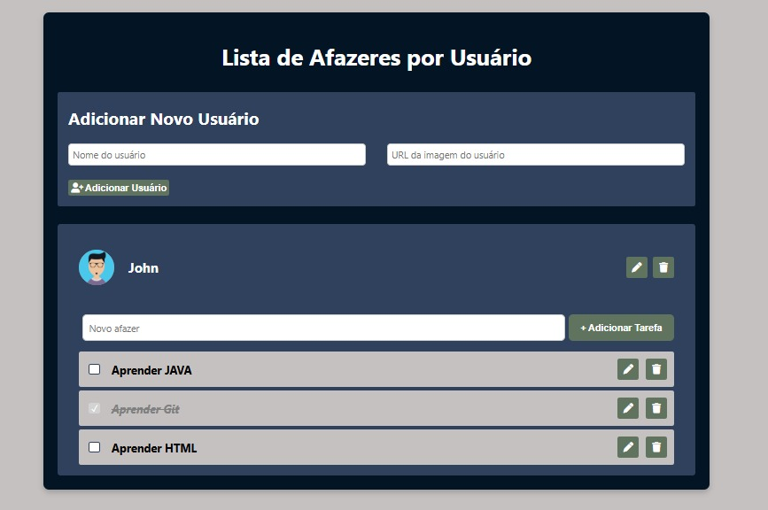

<h1 align="center" style="font-weight: bold;">To do List 💻</h1>


<p align="center">
 <a href="#description">Description</a> • 
  <a href="#layout">Layout</a> •
 <a href="#instructions">Instructions For Use</a> •
 <a href="#contribute">Contribute</a>
</p>

<h2 id="description">📌 About</h2>
Uma aplicação web desenvolvida utilizando HTML, CSS e JavaScript, permitindo a criação de múltiplos usuários e suas respectivas tarefas. Os usuários podem ser editados ou excluídos, e as informações são armazenadas localmente no localStorage do navegador em formato JSON. Os dados armazenados incluem: user.avatar, user.name, user.id e user.tasks.
Este projeto foi criado durante meu estágio em Desenvolvimento Fullstack no programa de bolsas da Compass UOL.

<H2 id="layout">🎨 Layout</h2>
<p align="center">
    
</p>

<H2 id="instructions"> Instructions</h2>
<h3>Cloning</h3>
How to clone my project

```bash
git clone https://github.com/cauewcampos/todo_list.git
```
<h3>Use</h3>

1. Abra o arquivo index.html ou utilize a extensão Live Server para visualizar a aplicação.

2. Insira o nome do usuário e a URL do avatar nos campos de input correspondentes.

3. Clique no botão "Adicionar Usuário" para criar um novo usuário.

4. Para adicionar tarefas, insira o texto da tarefa no campo "Novo afazer" e clique em "Adicionar Tarefa".

5. Você pode editar ou excluir tanto o usuário quanto as tarefas ao clicar nos respectivos ícones de editar (lápis) e excluir (lixeira).

6. As informações dos usuários e suas tarefas serão salvas automaticamente no localStorage e carregadas ao reabrir a página.


